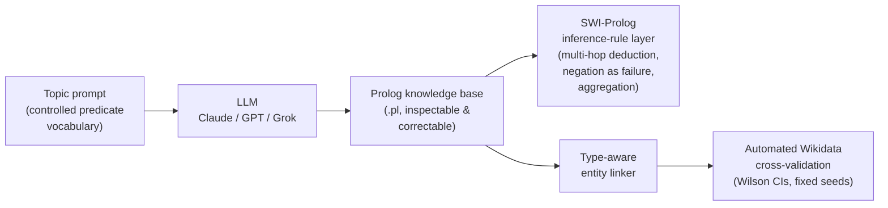
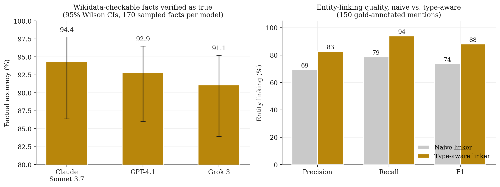

# GOFAI meets Generative AI

**Development of Expert Systems by means of Large Language Models**

[](https://arxiv.org/abs/2507.13550)
[](https://doi.org/10.48550/arXiv.2507.13550)
[](LICENSE)
[](https://www.python.org/)
[](https://www.swi-prolog.org/)

Code, prompts, generated knowledge bases and validation harnesses for the paper

> Eduardo C. Garrido-Merchán and Cristina Puente.
> *GOFAI meets Generative AI: Development of Expert Systems by means of Large Language Models.*
> [arXiv:2507.13550](https://arxiv.org/abs/2507.13550) [cs.AI], 2025.

The pipeline distils the knowledge of a large language model into a symbolic
**Prolog** knowledge base under a controlled predicate vocabulary, so that it can
be inspected and corrected by human experts and queried by a deterministic
inference engine — combining the recall of LLMs with the precision and
explainability of classical symbolic AI.

## Pipeline at a glance



## What is in this repository

- **101 generated Prolog knowledge bases** (~16,000 clauses) on philosophy,
  literature and history topics, produced by three LLM families:
  Claude Sonnet 3.7, GPT-4.1 and Grok 3, plus a Claude Haiku/Sonnet/Opus
  tier comparison.
- The **extraction scripts and prompts** that produce them
  (`extraction/`), one per model family.
- A **type-aware entity linker** and a fully automated, cached and
  reproducible **Wikidata validation harness** (`experiments/`).
- A domain-independent **Prolog inference-rule layer**
  (`experiments/reasoning/rules.pl`) that answers multi-hop deductive,
  negation-as-failure and aggregation queries over any generated base.
- The **manuscript** (`paper/main.pdf`) and every script needed to
  reproduce the quantitative claims in it.

## Headline results



Factual accuracy of the Wikidata-checkable facts (170 sampled facts per
model, 95% Wilson confidence intervals, type-aware linker):

| Model | Accuracy | 95% CI | Coverage |
|---|---|---|---|
| Claude Sonnet 3.7 | **94.4%** | [86.4, 97.8] | 41.8% |
| GPT-4.1 | **92.9%** | [86.0, 96.5] | 57.6% |
| Grok 3 | **91.1%** | [83.9, 95.2] | 59.4% |

The type-aware entity linker raises linking F1 from **73.8%** to **88.1%**
(precision 69.4 → 82.8, recall 78.8 → 94.1, on 150 gold-annotated mentions),
which isolates the disambiguation bottleneck from genuine hallucination.

All numbers are computed by `experiments/compute_stats.py` from
`experiments/results/summary.json`; the figure above is generated by
`assets/make_figure.py` from the same file.

## Quickstart: query a generated expert system

The knowledge bases are plain Prolog under a controlled vocabulary
(`concept/1`, `related_to/2`, `influenced_by/2`, `developed/2`,
`part_of/2`, `causes/2`, ...). For example, from
`knowledge_bases/claude_sonnet_3_7/aristotle_knowledge_network.pl`:

```prolog
part_of(material_cause, four_causes).
part_of(formal_cause, four_causes).
influenced_by(aristotle, plato).
developed(philippa_foot, neoaristotelian_virtue_ethics).
```

Load a base together with the inference-rule layer and ask multi-hop
questions:

```bash
swipl -q knowledge_bases/claude_sonnet_3_7/aristotle_knowledge_network.pl \
         experiments/reasoning/rules.pl
```

```prolog
?- influenced_by(aristotle, X).      % direct fact
X = plato.

?- influenced_chain(aristotle, A).   % transitive closure, derived by rules.pl
```

A full reasoning transcript (direct, transitive, negation-as-failure and
aggregation queries over the Plato base) is in
`experiments/reasoning/results_reasoning.txt`.

## Reproducing the experiments

```bash
cd experiments
python3 -m venv venv && ./venv/bin/pip install "anthropic>=0.69" requests scipy numpy

# Large-scale Wikidata validation across Claude Sonnet 3.7 / GPT-4.1 / Grok 3
./venv/bin/python validate_corpus.py --per-file 14 --per-model 170 --link-eval 150
./venv/bin/python compute_stats.py

# Expert-system reasoning over a generated knowledge base
cd reasoning && swipl -q -g main -t halt rules.pl
```

The Wikidata validation uses the free public Wikidata API (no API key
needed) and caches every lookup locally, so runs are resumable and
reproducible. Random seeds are fixed. The reasoning experiments were run
with SWI-Prolog 9.2.9. See `experiments/README.md` for the full map from
scripts to the numbers in the paper.

## API keys

Only the *extraction* scripts call LLM APIs; they read credentials from
environment variables (`ANTHROPIC_API_KEY`, `OPENAI_API_KEY`,
`XAI_API_KEY`). No key is stored in the repository. Reasoning, validation
and analysis need no API key.

## Citation

If you use this code or the generated knowledge bases, please cite the
arXiv paper:

```bibtex
@misc{garridomerchan2025gofai,
  title         = {{GOFAI} meets Generative {AI}: Development of Expert Systems
                   by means of Large Language Models},
  author        = {Garrido-Merch{\'a}n, Eduardo C. and Puente, Cristina},
  year          = {2025},
  eprint        = {2507.13550},
  archivePrefix = {arXiv},
  primaryClass  = {cs.AI},
  doi           = {10.48550/arXiv.2507.13550},
  url           = {https://arxiv.org/abs/2507.13550}
}
```

## License

Released under the [MIT License](LICENSE).
